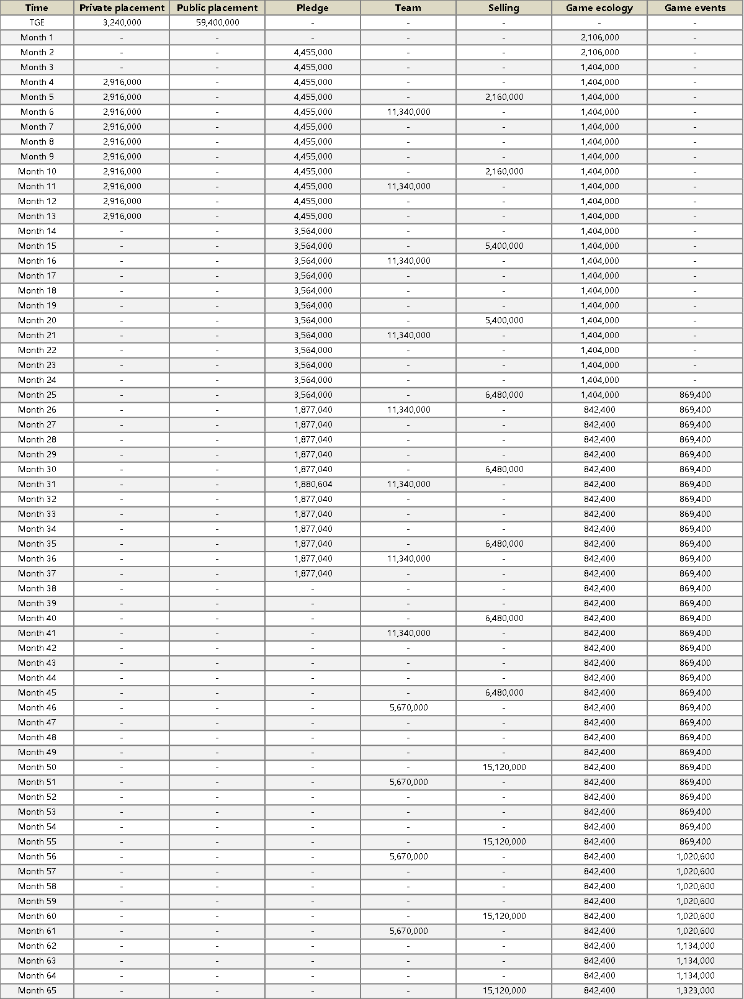

# $RHC

$RHC is Resurgence of the world of Hope's governance token. $RHC holders have the right to vote on key processes in game governance. Players participate in PVP to earn $RHC as a reward.

**Total supply: initial 540,000 million**

**Timetable of publishing tokens**

.png>)
