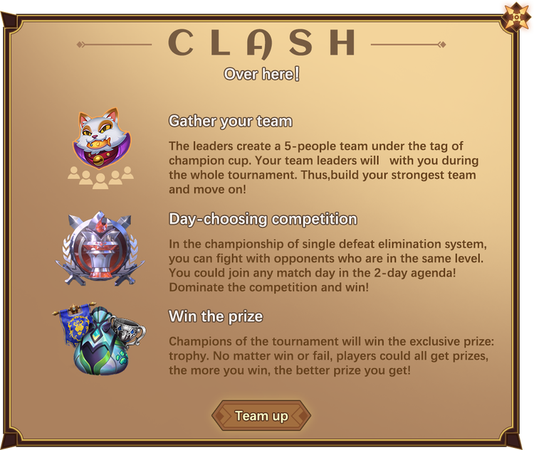

# Challenge

We're opening up challenge gameplay in the U.S., Europe, Latin America, Brazil, Oceania, Korea, Turkey, Russia, Vietnam, Japan.

The event is an online event, in which players form teams and participate in any match in a match held every two days. Competition for single-defeat elimination system; There will be two teams from each division for a total of 20 teams.

The final player will receive the official NFT award and the qualification for the subsequent invitational tournament.

