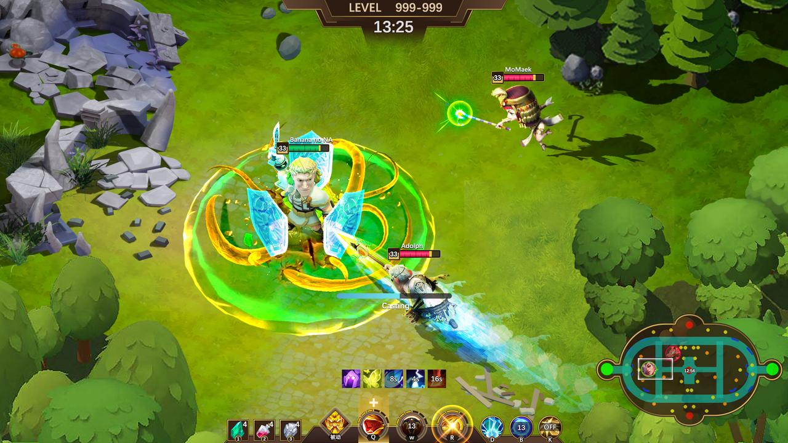

# Battle

Does the fetter of the team find enough teammates you can trust in the game? Will you trust him with your back?

The art of group warfare, fresh heroes, cool special effects, what makes your heart throb is the five kills? Or victory?

Is the playing method of the battle a hearty battle, or the "stealing points" of the extreme operation.

Wild monster's killing, extreme wild brushing speed, soul stirring anti wild action, in this wild area, you are the ultimate master.

Just as the battle system of League of legend has experienced countless iterations, we expect ROH to have many + battle optimization in the next few years.

